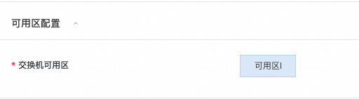

# Demo服务实例部署文档
Baichuan 2 是百川智能推出的新一代开源大语言模型，采用 2.6 万亿 Tokens 的高质量语料训练。Baichuan 2 在多个权威的中文、英文和多语言的通用、领域 benchmark 上取得同尺寸最佳的效果。
Deepgpu-LLM是阿里云专属的LLM模型推理加速套件，可以免费获取和使用。

本文介绍如何基于计算巢快速搭建基于DeepGPU-LLM加速的baichuan2-7b-chat对话机器人。
# 1 搭建流程
## 1.1 找到计算巢入口
在阿里云官网搜索“计算巢服务”，进入管理控制台，点击“服务市场”并搜索“baichuan”找到服务入口（见下图）。

也可以点击
[下面链接](https://computenest.console.aliyun.com/service/instance/create/cn-hangzhou?type=user&ServiceId=service-b765590a93ba46fe81e1)直接进入服务。

## 1.2 选择部署地域
确保有机器，如果没有机器可以更换地域。

## 1.3 选择实例

## 1.4 设置机器ssh登陆密码

## 1.5 设置webui登陆密码

## 1.6 配置可用区

## 1.7 配置网络
选择新建VPC，默认即可，无需配置。

如果已有VPC（VPC数量会有限制，无法无限创建），就无需新建VPC，可以直接选择已有VPC。

## 1.8 配置开源模型
到[modelscope.cn](https://modelscope.cn/home)上找自己需要的baichuan2-7b模型，把模型标识填到响应的文本框内，并选择模型精度。如下图所示，将从modelscope下载baichuan-inc开源的Baichuan2-7B-Chat模型，运行int8量化推理。

## 1.9 点击“下一步：确认订单”
系统会自动校验上述参数配置，校验通过后点击下一步。

## 1.10 勾选条款并点击“立即创建”

## 1.11 等待服务部署完成
大概需要40分钟～1个小时左右，主要耗时在开源模型下载速度。

# 2 如何使用
部署完成后，就可以打开webui进行对话了。
## 2.1 打开实例，找到webui入口，点击进入

## 2.2 输入账号密码
参见1.5节设置的账号密码
## 2.3 等待模型初始化
LLM模型文件较大，模型初始化需要一定时间，请耐心等待。刷新查看是否初始化完成，若初始化完成，下方红框部分会有具体模型名称显示。

## 2.4 输入对话内容，进行对话体验
初始化完成后，就可以进行对话了。

